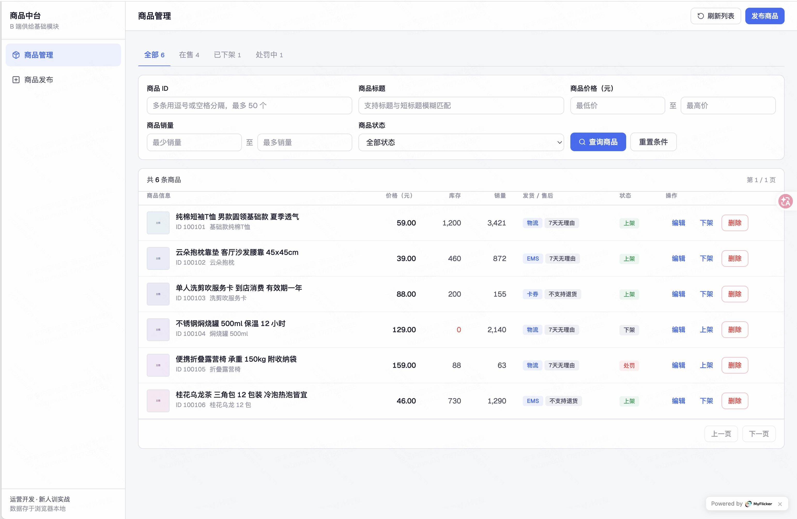
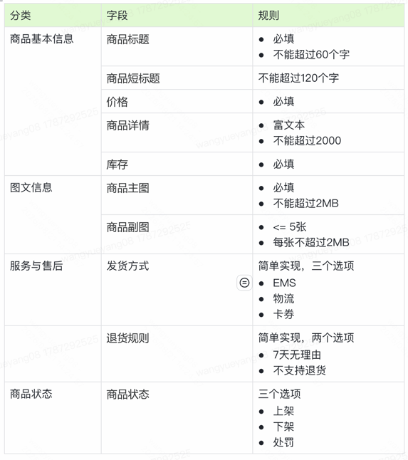

# 实践题目：商品管理

背景： 商品在B端作为所有供给的基础是构成B端系统最重要的环节，当前需要构建一个商品管理模块，这模块含商品发布和商品管理功能

## 评判标准：

- L0:  功能完成度： 基本的商品发布、商品功能功能
- L1:   不同的业务场景对商品的字段要求会不一样，我们该如何做更好的设计(如电商的实物商品、生服虚拟商品、商业化的素材)
- L3： 商品会被其他系统使用，在海量商品存储和高QPS场景下如何做到系统稳定
- 实现方式： 全程项目制体验。 vibe coidng 或者 harness

# 商品管理
一： 系统页面：需要两个前端管理页面， 商品管理和商品发布商品管理	商品发布

| 商品管理                  | 商品发布 |
|-----------------------|----|
|  | 稍后 |

二： 商品模型 

